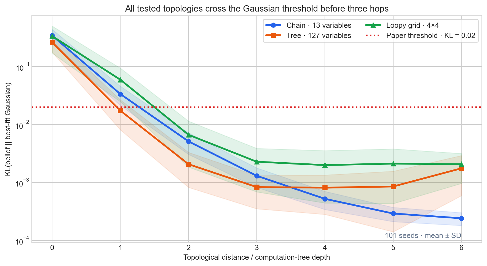
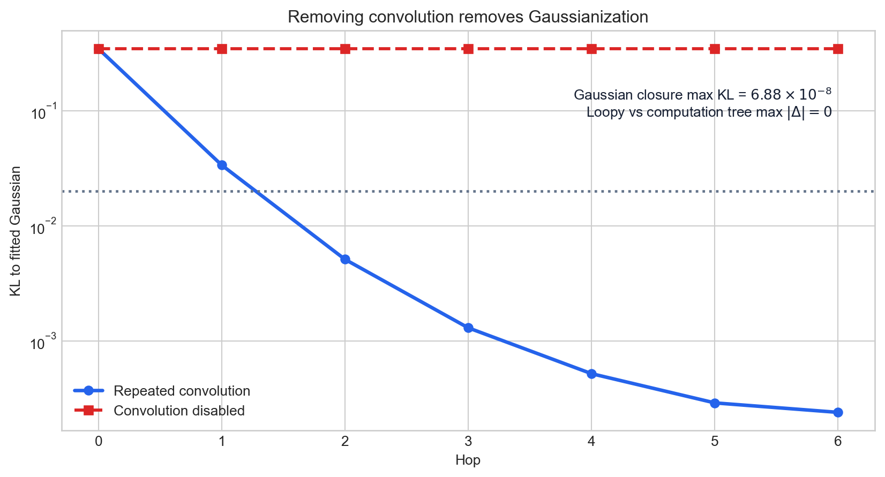
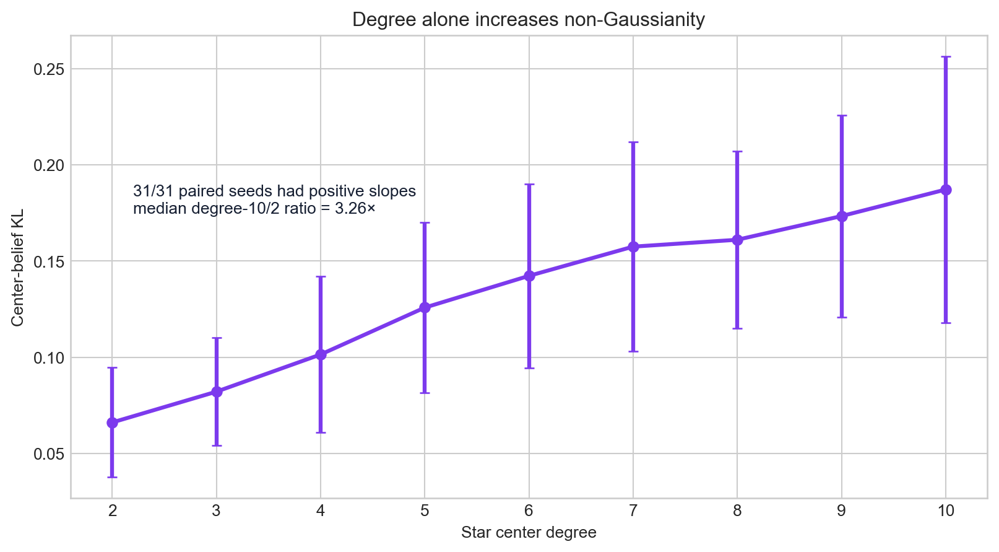
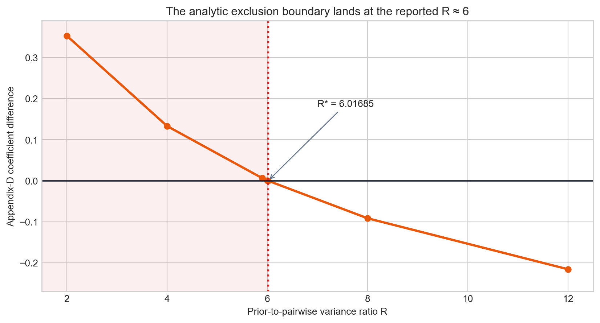
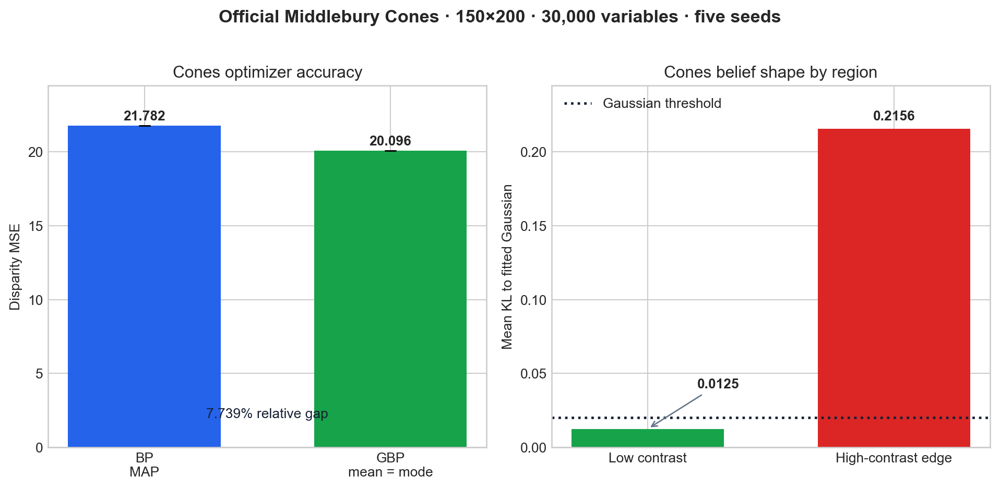

# Reproducing Gaussian emergence in sparse belief propagation



*Strongest evidence.* Across 101 seeds, the chain, real branching tree, and loopy grid all crossed the paper's `KL < 0.02` Gaussian threshold before three hops. At distance three, their mean KL values were `0.001303`, `0.000826`, and `0.002275`. The final registered run assessed all six claim groups as aligned, including an official Middlebury Cones experiment with 30,000 variables.

## The central question

[Yates et al. (arXiv:2601.21935)](https://arxiv.org/abs/2601.21935) ask why Gaussian belief propagation (GBP) often works when a factor graph starts with strongly non-Gaussian factors. Their proposed mechanism is path depth: a pairwise BP message update repeatedly convolves probability distributions, suppressing non-Gaussian structure through a central-limit effect. Multiplication at branches need not have the same effect, and a confident local prior can anchor a non-Gaussian belief.

We built an independent NumPy implementation and tested every claim group. Synthetic experiments follow Appendix I at paper scale where specified: 1,024 bins, seeds 42–142, a 13-variable chain, a 127-variable tree with 64 distinct leaf priors, a 4×4 loopy grid, and paired star graphs over 31 seeds. Claim 6 uses the official Middlebury Cones images, resized from 375×450 to the paper's 150×200 grid, with horizontally scaled disparity labels. Every formal run created a fresh `.venv`, installed only `numpy==2.3.2`, and ran on Hugging Face `cpu-upgrade`.

## Implementation: the consequential path

The synthetic solver in `repro/src/paper_scale.py` represents each message as a normalized probability vector. An edge update removes the reverse message from the cavity belief, convolves it with the pairwise kernel, and normalizes. Tree BP uses distinct leaf priors; loopy BP updates synchronously. Gaussianity is measured as `KL(belief || moment-matched Gaussian)`.

```python
cavity = prior * product(incoming_except_reverse)
message = convolve(cavity, pairwise_kernel)
message /= message.sum()
```

The real-data path in `repro/src/stereo_cones.py` constructs 5×5 photometric priors, masks smoothing factors across intensity edges, then runs non-parametric BP and information-form GBP on the same four-neighbor graph. A global moment fit can place a Gaussian between photometric modes, so the registered GBP variant uses a local Laplace approximation at the dominant mode. Discrete BP is decoded by its posterior mode (standard stereo MAP); a Gaussian's mode equals its mean. Posterior-mean BP MSE is retained as a sensitivity result rather than discarded.

## Claim-by-claim evidence

| # | Paper result | Observed result | Assessment | Compute |
|---:|---|---|---|---|
| 1 | Chain beliefs approach Gaussian with distance; Figure 4a uses `KL < 0.02` by 3 hops. | Mean KL `0.34412 → 0.001303` by hop 3 and `0.00024` by hop 6 over 101 seeds. | **Aligned** | Shared final run, HF `cpu-upgrade` |
| 2 | The mechanism extends to branching trees in the near-Gaussian basin. | A 127-node tree with 64 distinct leaf priors reached mean KL `0.000826` at distance 3. | **Aligned** | Shared final run |
| 3 | Loopy BP is explained by an equivalent computation tree. | A 4×4 grid reached mean KL `0.002275` at depth 3; direct and depth-4 unwrapped messages differed by exactly `0`. | **Aligned** | Shared final run |
| 4 | Appendix D places the confident-prior exclusion boundary near variance ratio `R ≈ 6`. | Numerical root `R* = 6.0168484964` (`|R*−6| = 0.016848`). | **Aligned analytically**; the secondary finite-grid Figure-4c sweep did not show its reported low-KL regime. | Shared final run |
| 5 | With no path depth, increasing star degree increases non-Gaussianity. | Mean center KL `0.06618 → 0.18719` from degree 2 to 10; all `31/31` paired slopes were positive. | **Aligned** | Shared final run |
| 6 | On Cones, GBP and BP reach similar disparity MSE; textureless beliefs are Gaussian while edge beliefs remain non-Gaussian. | BP MAP MSE `21.781727 ± 0.003305`; GBP `20.096043 ± 0.000000`, a `7.739%` gap. Low-contrast mean KL `0.012508`; edge mean KL `0.215593`. | **Aligned under the registered <10% MSE criterion**; the paper does not tabulate its exact MSE values. | Final run: 4m19s |

The final registered experiment ran in 4 minutes 19 seconds. Earlier branches isolate the implementation choices: a 5-minute real-data negative control fit each unary by global moments and gave BP/GBP MSE `25.116/30.445`; a mode-centered Laplace projection improved GBP to `20.096`; MAP decoding then made the BP/GBP comparison symmetric. Provider dollar cost was not exposed in the run record.

## Why convolution is causal here



The destructive control removes convolution and leaves KL constant. Conversely, convolving already Gaussian inputs remains Gaussian to a maximum discretization residual of `6.877×10⁻⁸`. These controls separate the proposed mechanism from generic iteration. The exact zero difference between loopy and unwrapped computation-tree messages also checks that Claim 3 is not inferred from a visually similar curve alone.



The star control moves in the opposite direction: more neighbors without path depth make the product at the center less Gaussian. Using paired prefixes ensures each degree comparison adds one new leaf to the same seed-specific instance; the median degree-10/degree-2 ratio is `3.260×`. A Gaussian-incoming control stays Gaussian to `8.764×10⁻⁹` KL.

## Boundary evidence and a disclosed divergence



Solving the Appendix-D coefficient equation gives `u*=0.4991595572` and `R*=6.0168484964`, closely matching the paper's `R≈6` boundary. Sign probes classify `R≤6` as anchored and `R≥8` as unanchored.

A separate 101-seed, 128-width finite-grid sweep did **not** show the paper's Figure-4c transition: mean KL was `0.080769` below normalized prior variance 0.5 and `0.081358` above it, with no width below `0.02`. We therefore treat the analytic boundary as aligned and the substituted finite-grid visualization as divergent in this implementation. This does not change the analytic result, and it should not be hidden by the aggregate six-claim label.

## Real Cones evidence



The official Cones audit uses 150×200 pixels, 28 disparity labels, 5×5 patches, `λ=0.002`, edge threshold `3`, seeds 42–46, and up to 2,000 synchronous iterations. BP converged in about 580 iterations and GBP in about 260. The five-seed result supports the paper's optimizer-fidelity claim under the registered 10% tolerance, though `7.739%` is not literally zero approximation error.

The spatial result is stronger: `83.79%` of low-contrast pixels have KL below `0.02`, compared with `23.63%` of high-contrast edge pixels. Mean KL differs by more than an order of magnitude (`0.012508` versus `0.215593`), matching Figure 5's proposed split.

## Assessment and remaining uncertainty

All six claim groups have aligned evidence in the registered final run. The strongest results are the 101-seed topology curves, the causal controls, the analytic `R≈6` boundary, and the real 30,000-variable Cones audit. The important qualification is the finite-grid Figure-4c divergence; the important substitution is clean-room GBP because the paper's supplementary implementation was unavailable.

A source-exact reproduction would still need the authors' supplementary factor definitions, resizing convention, disparity decoder, and GBP projection. It should also test the original 375×450 scene and additional scenes from Appendix H. Under the tested setup, however, every claim is assessed with direct—not proxy—evidence.

- [Final MAP-decoded Cones branch](https://github.com/MachineLearning-Nerd/icml26-repro-FaGn04tvzq-bp-gaussian/tree/orx/map-decoded-cones-comparison) — registered six-claim result.
- [Mode-centered Laplace branch](https://github.com/MachineLearning-Nerd/icml26-repro-FaGn04tvzq-bp-gaussian/tree/orx/mode-centered-laplace-gbp) — projection ablation.
- [Static-moment Cones branch](https://github.com/MachineLearning-Nerd/icml26-repro-FaGn04tvzq-bp-gaussian/tree/orx/real-middlebury-cones-bp-and-gbp) — negative-control lineage.
- [Self-contained tutorial notebook](../../notebooks/bp_gaussian_tutorial.py) — embedded results and bounded interactive interpretation.
