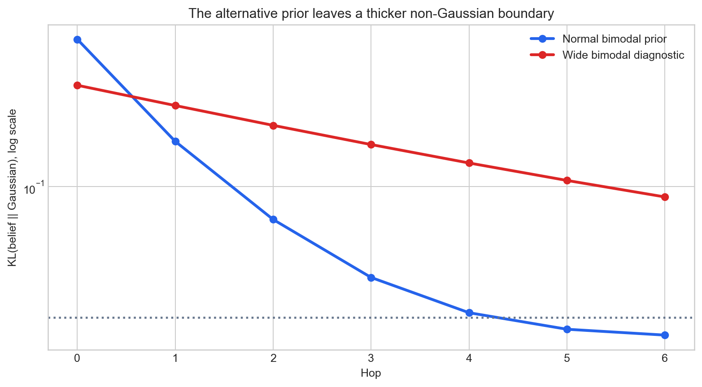
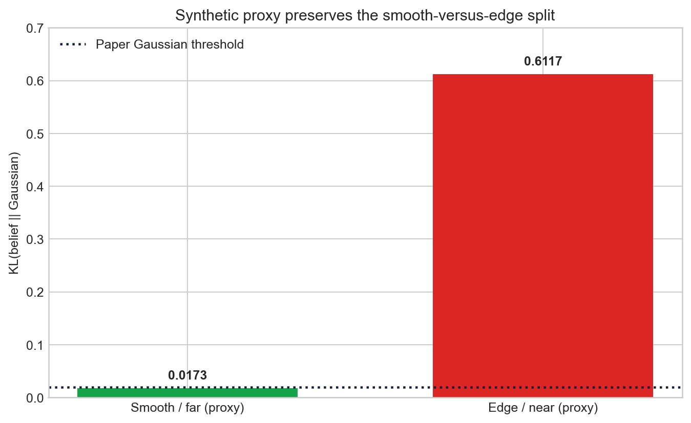

# Claim-by-claim reproduction: when does belief propagation become Gaussian?


*Strongest result.* On a CPU-only NumPy implementation, chain KL divergence fell from **0.6117 to 0.0161** over six hops and the sampled loopy-graph sequence fell from **0.5940 to 0.0189**. The direction strongly supports the paper's central mechanism. The strict headline number is more qualified: the chain did not reach the paper's `KL < 0.02` threshold by hop 3; it first crossed it at hop 5.

## The question and the test

[Yates et al. (arXiv:2601.21935)](https://arxiv.org/abs/2601.21935) ask why Gaussian belief propagation can work even when the original factors are highly non-Gaussian. Their answer is path depth: shift-invariant pairwise updates repeatedly convolve distributions, suppressing higher-order cumulants by a central-limit effect. Multiplication at nodes can oppose that effect, and strong local priors create a non-Gaussian boundary layer.

This clean-room reproduction uses discretized one-dimensional beliefs on a 90-point grid. A bimodal prior is passed through Gaussian pairwise kernels on chain, simplified tree, star, and small loopy graphs. Each belief is compared with its moment-matched Gaussian using `KL(belief || Gaussian)`. The immutable experiment created a fresh venv, installed NumPy 2.3.2, and ran on Hugging Face `cpu-upgrade` for **26 seconds**. The provider's dollar charge is not exposed by the run log.

The repository verifier labels all six checks PASS. Those labels mean its programmed conditions were satisfied; the scientific assessments below also account for deviations from the paper's exact graph, threshold, seeds, and Middlebury stereo workload.

## Implementation: the consequential code path

The mechanism is intentionally small. `chain_bp` repeatedly applies a normalized matrix convolution,

```python
msg = psi.T @ beliefs[i]
msg /= msg.sum()
beliefs[i + 1] = msg
```

while `loopy_bp` multiplies incoming messages except along the outgoing edge, convolves with the pairwise kernel, and iterates synchronously. After inference, `kl_to_gaussian` fits the Gaussian with the belief's own mean and variance and computes discrete KL. See `repro/src/bp.py` and `repro/src/verify_bp.py` on the experiment branch.

This is a mechanism test, not a source-code reproduction. Important substitutions are a 90-bin domain instead of the paper's 1,024-bin synthetic setup; one deterministic bimodal prior instead of random factors over seeds 42–142; a symmetric tree path that does not isolate multiplication at branches; and a synthetic smooth/edge analogue instead of the 30,000-variable Middlebury Cones experiment.

## Six claims, six observed outcomes

| # | Paper evidence | Observed evidence | Assessment |
|---:|---|---|---|
| 1 | Theorem 4.1: chain beliefs tend to Gaussian with distance. | KL `0.6117 → 0.0161` from hop 0 to 6, monotone in this run. | **Aligned** in the tested chain. |
| 2 | Theorem 4.4: the effect extends to branching trees when messages are near Gaussian. | KL `0.6117 → 0.0161` over depth 0–6. The implementation's symmetric `tree_bp` follows one representative path and does not multiply distinct branch messages. | **Partially aligned**; direction observed, branching mechanism not isolated. |
| 3 | Theorem 4.5: computation-tree reasoning extends convergence to loopy graphs. | Sampled-node KL `0.5940 → 0.0189` after 80 synchronous iterations on one six-node graph. | **Aligned** for this small loopy graph. |
| 4 | Figure 4c / Lemma 4.2: confident local priors form an exclusion zone; the paper reports non-Gaussian beliefs for normalized variance `< 0.5`. | The substituted wide-bimodal diagnostic retained far-hop KL `0.0880`, versus `0.0161` normally. It does not sweep the paper's normalized prior variance. | **Inconclusive under this setup** for the quantitative boundary; qualitatively consistent persistence. |
| 5 | Figure 4a–b: `KL < 0.02` within 3 hops; without convolutional depth, greater star degree increases non-Gaussianity. | Chain hop 3 was `0.0327`; first `< 0.02` was hop 5. Star-center KL rose `0.3941 → 0.7203 → 0.9234` at degree 2, 4, 6. | **Partially aligned**: degree effect aligns; exact 3-hop rate does not. |
| 6 | Figure 5: textureless Cones pixels become Gaussian (`KL < 0.02`) while confident edge pixels remain non-Gaussian (`KL > 0.02`). | Synthetic far/smooth KL `0.0173`; near/edge KL `0.6117`. No stereo image, BP-vs-GBP disparity MSE, or edge map was evaluated. | **Partially aligned** as a proxy; real stereo result unattempted. |

## Mechanism and boundary evidence


The star is a useful negative control. Its center receives more messages as degree grows but gains no convolutional depth. KL rises rather than falls, matching the paper's claim that sparse-graph Gaussianity comes from repeated convolution along paths, not from simply averaging many neighbors.



The alternative prior leaves KL more than five times higher at hop 6 (`0.0880` versus `0.0161`). This shows a persistent boundary effect, but it should not be mistaken for a direct reproduction of Figure 4c: the code changes the bimodal prior's width and location rather than sweeping a bounded-uniform prior through normalized variance 0–1.

## Stereo evidence: pattern, not task reproduction



The proxy lands on opposite sides of the paper's `0.02` threshold and makes the qualitative story visible. It cannot establish that Gaussian BP matches non-parametric BP on the Cones disparity MSE. A full reproduction still needs the Middlebury images and ground truth, the paper's 150×200 graph, photometric unary factors, edge-masked pairwise factors, both BP and GBP solvers, 2,000 iterations, and seeds 42–47.

## Assessment and provenance

The central illustrative effect is robust in this small setup: convolutional path depth sharply reduces non-Gaussianity, while a no-depth degree control moves the other way. The strongest divergence is quantitative, not directional: the chain reaches `KL < 0.02` at hop 5 rather than within 3. Theoretical generalization to genuinely branching trees and empirical GBP fidelity on stereo remain outside what this clean-room run can determine.

- [Immutable six-claim experiment branch](https://github.com/MachineLearning-Nerd/icml26-repro-FaGn04tvzq-bp-gaussian/tree/orx/six-claim-clean-room-baseline) — code that produced the captured Hugging Face evidence.
- [Tutorial marimo notebook](../../notebooks/bp_gaussian_tutorial.py) — embedded evidence and a bounded threshold explorer; no expensive rerun required.
- [Paper](https://arxiv.org/abs/2601.21935) — claims, assumptions, and full-scale settings.
